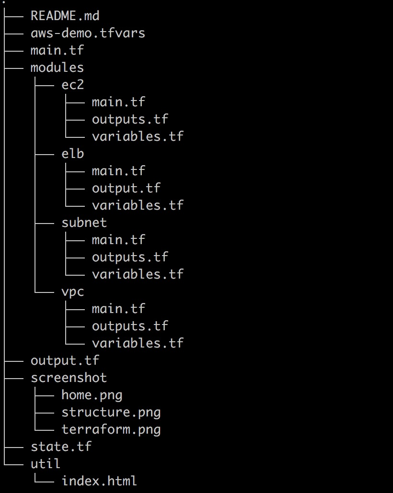

# Terraform webserver

This Terraform code create a VM in AWS cloud with apache webserver installed on it . The webserver run behind a Load Balancer(ELB). 


This code uses terraform 0.12
 [Terraform](https://www.terraform.io/). 

## Directory Description
### modules: This store aws components which this framwork need by terraform codes. 


## Step One: Prerequisites
Create a file name xxx.tfvars, For example:
auto-demo.tfvars

```
# aws-demo.tfvars
environment = "dev"
region = "ap-southeast-2"
vpc_cidr = "10.100.0.0/16"
public_subnet_cidrs = "10.100.1.0/24"
instance_type = "t2.micro"

private_key_path ="~/interview/id_rsa"
public_key_path= "~/interview/id_rsa.pub"
key_name= "id_rsa"
application= "Web Server"

```

```bash
$ terraform init
$ terraform validate -var-file=aws-demo.tfvars
$ terraform plan -var-file=aws-demo.tfvars
$ terraform apply -var-file=aws-demo.tfvars
```


## Step Two: Check Running Result
After terraform apply running successfully, in the output you will see: EC2_IP and ELB_DNS_NAME (ELB need 1 to 2 minutes to start up after terraform run over. So we should better try  EC2_IP first). 


Then Put EC2_IP or ELB DNS NAME into Internet Browser, you should see Page:


##  Step update index.html or apache configuration
Please see ansible readme.md

